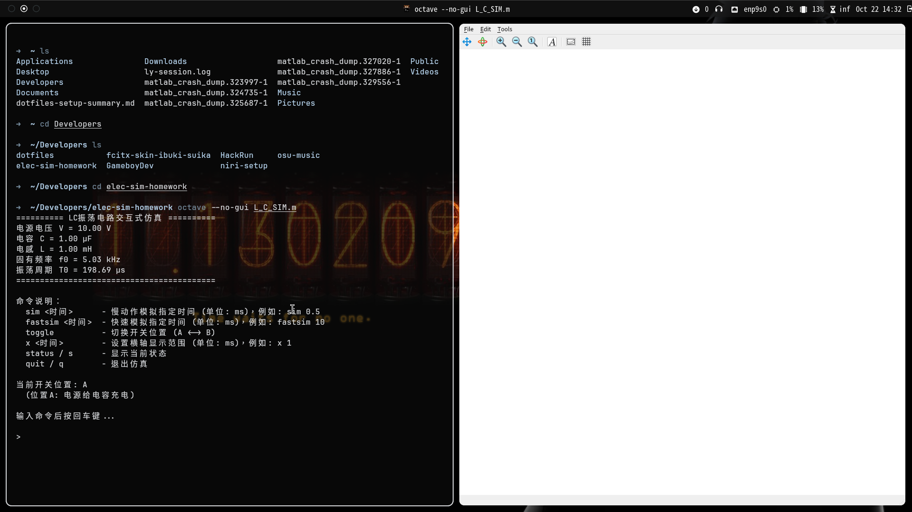
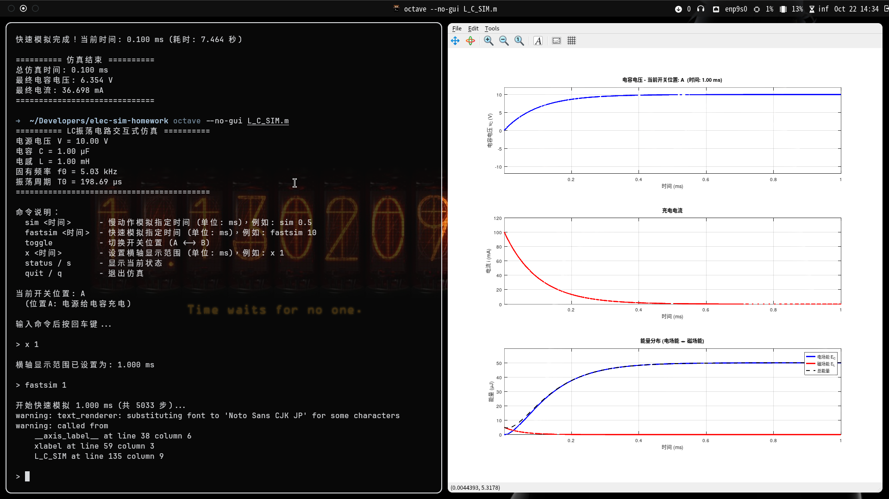
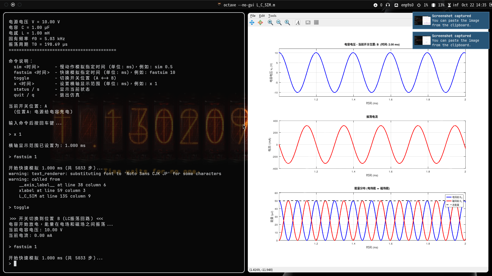
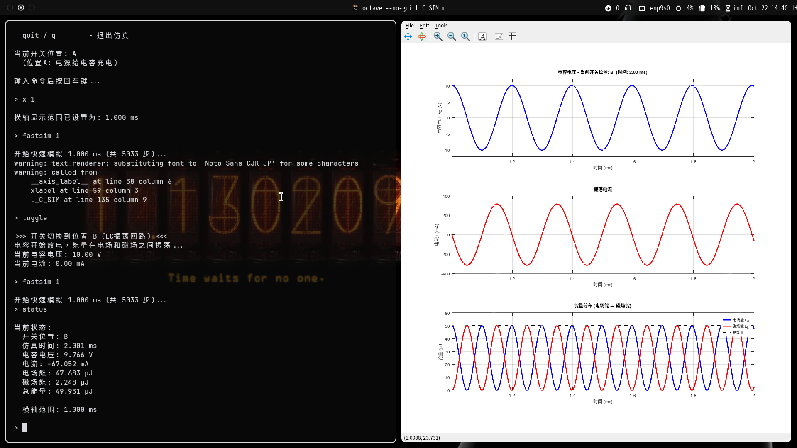
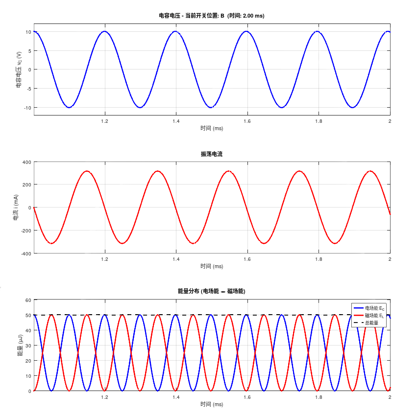

<div style="page-break-after: always;">

<div align="center">

# 上海大学2025~2026学年 秋季学期 电工技术课程 小论文（报告）

## 课程名称：电工技术  课程编号：________  
# 论文（报告）题目：使用仿真软件模拟LC震荡电路

</div>

论文评语：

成绩：

任课教师：

评阅日期：

</div>


# 摘要

本文通过GNU Octave开源科学计算软件（兼容Matlab）实现了LC震荡电路的交互式模拟，研究了理想无损耗条件下电容和电感之间的能量转换过程。仿真程序采用辛欧拉法求解微分方程，保证了长时间模拟下的能量守恒特性。通过可视化电容电压、电流和能量分布的动态变化，直观地展示了LC震荡电路中电场能和磁场能的周期性转换规律。

## 关键词

LC震荡电路；Octave仿真；能量转换；辛欧拉法；交互式模拟

# 一、引言

LC震荡电路是电工技术和电子技术领域中最基本也是最重要的电路之一，广泛应用于信号发生器、滤波器、谐振器和无线通信等领域。LC电路由电感（L）和电容（C）组成，当电路中存在初始能量时，能量会在电场和磁场之间周期性转换，产生电磁振荡现象。

在实际教学中，由于LC震荡频率通常较高（kHz至MHz级别），传统的实验设备难以直观展示电压、电流和能量的动态变化过程。因此，采用计算机仿真技术可以有效解决这一问题，通过可视化手段帮助学生深入理解LC震荡的物理本质。

本文设计并实现了一个基于GNU Octave的LC震荡电路交互式仿真程序。Octave是一款开源的科学计算软件，语法与MATLAB高度兼容，具有强大的数值计算和绘图功能，且完全免费，非常适合教学使用。该仿真程序具有以下特点：

1. **交互式操作**：用户可以通过命令控制开关状态，模拟充电和振荡两个阶段；
2. **精确求解**：采用辛欧拉法（Symplectic Euler Method）求解微分方程，保证能量守恒；
3. **实时可视化**：动态显示电容电压、电流和能量分布曲线；
4. **灵活控制**：支持慢速和快速模拟，以及自定义显示范围。

通过本仿真实验，可以研究LC电路的振荡特性、能量转换规律以及数值算法。

# 二、设计与仿真实现

## 2.1 LC震荡电路原理

LC震荡电路的基本工作原理可以分为两个阶段：

**（1）充电阶段**

当开关接通电源时，电源对电容充电。充电过程遵循一阶RC电路特性，电容电压逐渐趋近电源电压 $V$。充电过程的时间常数为 $\tau = RC$，其中 $R$ 为等效充电电阻。

充电过程可以用微分方程描述：

$$\frac{dv_C}{dt} = \frac{V - v_C}{\tau}$$

在仿真中采用数值方法求解，代码实现如下：

```matlab
% 充电阶段（开关位置A）
tau = 0.5 * T0;  % 充电时间常数
vc = vc + (V - vc) * dt / tau;
i = (V - vc) / (tau/C);  % 充电电流
```

**（2）振荡阶段**

当开关切换到LC回路时，电容开始通过电感放电。根据基尔霍夫电压定律：

$$v_C + v_L = 0$$

其中 $v_C = \frac{Q}{C}$ 为电容电压，$v_L = L\frac{di}{dt}$ 为电感电压。由于 $i = \frac{dQ}{dt}$，可得：

$$\frac{Q}{C} + L\frac{d^2Q}{dt^2} = 0$$

即：

$$\frac{d^2Q}{dt^2} + \omega_0^2 Q = 0$$

其中角频率 $\omega_0 = \frac{1}{\sqrt{LC}}$，振荡频率 $f_0 = \frac{\omega_0}{2\pi} = \frac{1}{2\pi\sqrt{LC}}$，周期 $T_0 = \frac{1}{f_0} = 2\pi\sqrt{LC}$。

在理想无损耗条件下，电路的总能量保持恒定：

$$E_{total} = E_C + E_L = \frac{1}{2}Cv_C^2 + \frac{1}{2}Li^2 = constant$$

其中 $E_C$ 为电场能，$E_L$ 为磁场能。能量计算的代码实现：

```matlab
% 能量计算
E_C = 0.5 * C * vc^2 * 1e6;     % 电容能量 (μJ)
E_L = 0.5 * L * i^2 * 1e6;      % 电感能量 (μJ)
E_total = E_C + E_L;            % 总能量 (μJ)
```

## 2.2 数值算法选择

LC震荡电路可以用如下微分方程组描述：

$$\frac{dv_C}{dt} = \frac{i}{C}$$

$$\frac{di}{dt} = -\frac{v_C}{L}$$

为了保证长时间模拟下的能量守恒，本仿真采用**辛欧拉法**（Symplectic Euler Method）进行数值求解。辛欧拉法是一种半隐式算法，通过交错更新变量，能够保持哈密顿系统的辛结构，从而保证能量守恒。

辛欧拉法的更新公式为：

$$i^{n+1} = i^n - \frac{v_C^n}{L}\Delta t$$

$$v_C^{n+1} = v_C^n + \frac{i^{n+1}}{C}\Delta t$$


辛欧拉法的核心代码实现：

```matlab
% LC振荡阶段（开关位置B）
% 使用辛欧拉法保持能量守恒
i = i - (vc / L) * dt;      % 先用旧的 vc 更新 i
vc = vc + (i / C) * dt;     % 再用新的 i 更新 vc
```

注意这里的关键在于**交错更新**：先用当前时刻的 $v_C^n$ 更新电流得到 $i^{n+1}$，再用新的电流 $i^{n+1}$ 更新电压得到 $v_C^{n+1}$。这种更新顺序保证了系统的辛结构，从而实现能量守恒。

## 2.3 仿真参数设置

仿真程序采用以下参数：

- **电源电压**：$V = 10$ V
- **电容**：$C = 1$ μF
- **电感**：$L = 1$ mH

根据公式计算：

- **固有频率**：$f_0 = \frac{1}{2\pi\sqrt{LC}} = \frac{1}{2\pi\sqrt{10^{-3} \times 10^{-6}}} \approx 5.03$ kHz
- **振荡周期**：$T_0 = \frac{1}{f_0} \approx 0.199$ ms

仿真时间步长设置为 $\Delta t = \frac{T_0}{1000}$，即每个周期采样1000个点，以保证计算精度。

参数初始化代码：

```matlab
% 参数设置
V = 10;              % 电源电压 (V)
C = 1e-6;            % 电容 (F) - 1 μF
L = 1e-3;            % 电感 (H) - 1 mH

% 计算振荡频率
omega0 = 1/sqrt(L*C);        % 角频率 (rad/s)
f0 = omega0/(2*pi);          % 频率 (Hz)
T0 = 1/f0;                   % 周期 (s)
dt = T0/1000;                % 时间步长

% 初始化状态变量
vc = 0;                      % 电容电压初始值
i = 0;                       % 电流初始值
```

## 2.4 仿真程序结构

本次仿真的电路图如下：


<div align="center">
<b>图1：LC震荡电路原理图</b>
</div>

仿真程序采用Octave语言（兼容MatLab）编写，主要包括以下模块：

1. **参数初始化模块**：设置电路参数、计算振荡频率和周期；
2. **数据存储模块**：预分配数组存储时间、电压、电流历史数据；
3. **物理状态更新模块**：根据开关位置更新电路状态
   - 位置A：充电过程，采用一阶RC模型
   - 位置B：振荡过程，采用辛欧拉法求解
4. **可视化模块**：实时绘制三个子图
   - 电容电压随时间变化
   - 电流随时间变化
   - 能量分布（电场能、磁场能、总能量）
5. **交互控制模块**：接收用户命令，控制仿真流程

程序支持以下命令：

- `sim <时间>`：慢动作模拟指定时间（单位：ms）
- `fastsim <时间>`：快速模拟指定时间
- `toggle`：切换开关位置（A ↔ B）
- `x <时间>`：设置横轴显示范围
- `status`：显示当前状态
- `quit`：退出仿真

# 三、实验内容

## 3.1 实验步骤

**步骤1：启动仿真程序**

在Octave或者Matlab环境中运行 `L_C_SIM.m` 脚本，程序自动计算并显示电路参数和振荡特性。可以通过命令行输入 `octave --no-gui L_C_SIM.m` 或者 Octave GUI中打开并运行该脚本，亦可直接在Matlab中运行

**图2：程序启动界面**



<div align="center">
<b>图2：仿真程序启动界面，显示电路参数和命令说明</b>
</div>

**步骤2：充电过程模拟**

开关初始位置为A（充电位置），输入`x 1` 显示范围改为 1ms，输入命令 `fastsim 1` 进行1 ms的快速模拟，观察电容充电过程。

**图3：充电过程波形**



<div align="center">
<b>图3：电容充电过程的电压、电流和能量曲线</b>
</div>

观察结果：
- 电容电压逐渐上升，趋近电源电压10V
- 充电电流逐渐减小
- 电场能逐渐增加，磁场能接近0

**步骤3：切换至振荡模式**

输入命令 `toggle` 将开关切换到位置B，电容开始通过电感放电，进入LC振荡状态。

**步骤4：观察振荡过程**

输入命令 `fastsim 1` 进行1 ms的快速模拟，观察完整的振荡周期。

**图4：LC振荡波形**



<div align="center">
<b>图4：LC电路振荡过程的电压、电流和能量变化</b>
</div>

观察结果：
- 电容电压呈正弦振荡，幅值约为±10V
- 电流呈正弦振荡，与电压相位差90°
- 电场能和磁场能周期性转换，总能量保持恒定


**步骤5：查看仿真状态**

输入命令 `status` 查看当前电路状态和能量信息。

**图5：状态信息显示**



<div align="center">
<b>图5：仿真程序状态信息显示</b>
</div>

## 3.2 实验数据分析

**（1）振荡频率验证**

通过测量波形周期，验证实际振荡频率与理论计算值的一致性。理论周期为：

$$T_0 = 2\pi\sqrt{LC} = 2\pi\sqrt{10^{-3} \times 10^{-6}} \approx 0.199 \text{ ms}$$

从仿真波形中测量得到的周期值应与此理论值基本一致，误差主要来源于数值离散化。

**（2）能量守恒分析**

在理想无损耗条件下，系统总能量应保持恒定。初始能量为：

$$E_{total} = \frac{1}{2}CV^2 = \frac{1}{2} \times 10^{-6} \times 10^2 = 50 \text{ μJ}$$

从仿真结果可以观察到，总能量曲线（黑色虚线）在长时间模拟下保持水平，验证了辛欧拉法的能量守恒特性。

**（3）相位关系分析**

根据理论分析，电容电压和电流之间应存在90°相位差：

- 当 $v_C$ 达到最大值时，$i = 0$（电场能最大）
- 当 $v_C = 0$ 时，$|i|$ 达到最大值（磁场能最大）

仿真波形清晰展示了这一相位关系。

**图6：电压与电流相位关系**



<div align="center">
<b>图6：电容电压和电流的相位关系（相位差90°）</b>
</div>

## 3.3 不同参数下的振荡特性

可以通过修改程序参数，研究不同电容或电感值对振荡频率的影响：

**表1：不同参数组合的振荡频率**

| 电容 C (μF) | 电感 L (mH) | 理论频率 f₀ (kHz) | 理论周期 T₀ (μs) |
|------------|------------|------------------|-----------------|
| 1.0        | 1.0        | 5.03             | 199             |
| 0.5        | 1.0        | 7.12             | 141             |
| 1.0        | 0.5        | 7.12             | 141             |
| 2.0        | 2.0        | 2.52             | 398             |

从表中可以看出，振荡频率 $f_0 \propto \frac{1}{\sqrt{LC}}$，增大电容或电感都会降低振荡频率。

## 四、结语

本文通过GNU Octave开源科学计算软件成功实现了LC震荡电路的交互式模拟，系统地研究了电容充电过程和LC振荡过程。仿真结果表明：

1. **能量守恒**：采用辛欧拉法进行数值求解，成功实现了长时间模拟下的能量守恒，总能量保持恒定；

2. **相位关系**：电容电压和电流之间存在90°相位差，电场能和磁场能周期性转换，符合理论预期；

3. **教学价值**：交互式仿真程序具有良好的可视化效果，可以作为电工技术课程的教学辅助工具，帮助学生直观理解LC震荡的物理本质。使用开源软件Octave也降低了实验成本，便于推广应用。

本仿真程序为理想无损耗模型，未考虑电阻损耗、辐射损耗等实际因素。在后续研究中，可以进一步扩展为RLC阻尼振荡电路，研究欠阻尼、临界阻尼和过阻尼等不同情况下的电路响应特性。此外，还可以将仿真结果与实际电路测量结果进行对比，分析实际电路中的非理想因素对振荡特性的影响。

通过本次仿真实验，不仅加深了对LC震荡电路理论的理解，也掌握了数值仿真的基本方法和技巧，为今后的科研和工程实践打下了良好基础。

---

# 参考文献

[1] 秦曾煌. 电工学（第六版）高等教育出版社

[2] GNU Octave官方文档. GNU Octave (version 10.3.0.）https://docs.octave.org/octave.pdf

[3] Google Gemini 2.5 Pro

[4] 知乎：李工谈元器件 还搞不懂 LC振荡电路原理？看这一文就够了，图文结合，立马带你搞定 https://zhuanlan.zhihu.com/p/532163425

# 仿真脚本源码链接

由于脚本过长，我将源码与本论文电子原稿存放在Github平台，链接：https://github.com/KirisameLonnet/LC-Sim